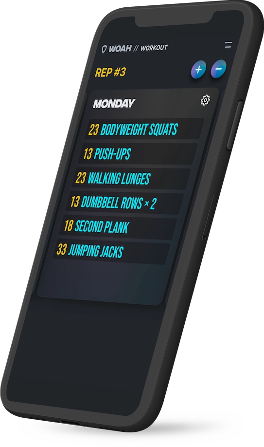
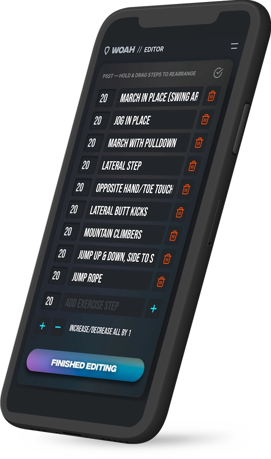

# Work Out At Home :: Progressive Web App

A simple Warmup & Workout timer / diary

|                                             Warmup timer                                              |                                       Workout Diary                                       |                                             Edit page                                              |
| :---------------------------------------------------------------------------------------------------: | :---------------------------------------------------------------------------------------: | :------------------------------------------------------------------------------------------------: |
|  |  |  |

## A Nuxt.js app hosted on Netlify

Just push to `main` to deploy!

## Build Setup

```bash
# install dependencies
$ npm install

# serve with hot reload at localhost:3000
$ npm run dev

# build for production and launch server
$ npm run build
$ npm run start

# generate static project
$ npm run generate
```
